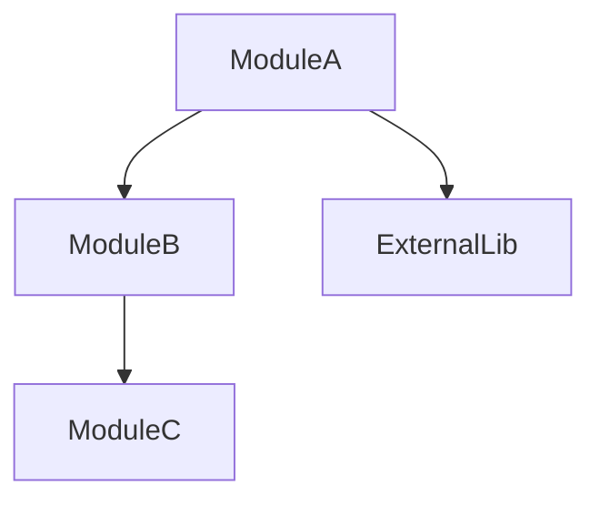
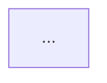

# Structure Analysis — Reverse Engineering Phase 1

Analyze the target codebase structure exhaustively. Identify ALL entry points, dependencies, modules, and components within the user-specified scope. Produce a structure map document and initialize `manifest.json` for pipeline chaining.

## Three Principles

These principles are non-negotiable. Violating any principle invalidates the analysis.

### 1. Code is Truth
- Document what IS implemented, not what SHOULD be implemented
- If code appears buggy, document the behavior as-is and note it in the Question List
- Prioritize actual code over comments, variable names, or documentation

### 2. Traceability to Line
- Every finding MUST include a `file:line` reference
- If a line number cannot be determined, exclude the finding and note it in the Question List
- References without line numbers are considered hallucination

### 3. Behavior over Intent
- Focus on observable behavior: inputs, outputs, side effects
- Do NOT infer business intent or "why" from code
- Document "what" and "how" only

## Execution

### Step 1: Setup

**Determine analysis name:**
- Use the `name` argument if provided
- Otherwise derive from target: class name, directory name, or file stem

**Detect language:**
- If `language` argument is provided, use it
- Otherwise detect from file extensions and project files:
  - `.cs` / `*.csproj` → `csharp`
  - `.py` / `pyproject.toml` / `setup.py` → `python`
  - `.ts` / `.tsx` / `package.json` with typescript → `typescript`
  - `.java` / `pom.xml` / `build.gradle` → `java`
  - Other → `generic`

**Load language reference:**
- Check if `references/{language}.md` exists in this skill's directory
- If it exists, read and apply the language-specific patterns
- If not, proceed with language-agnostic analysis

**Detect tool availability:**
- Check if Serena MCP tools are available (`mcp__serena__find_symbol`, etc.)
- If available, use Serena as primary analysis tools
- If not, use Read, Grep, Glob, Bash exclusively

**Create output directory and manifest:**
```bash
mkdir -p docs/reverse/{name}
mkdir -p docs/reverse/{name}/verification
```

Initialize `manifest.json`:
```json
{
  "name": "{name}",
  "language": "{detected-language}",
  "created": "{YYYY-MM-DD}",
  "updated": "{YYYY-MM-DD}",
  "targets": {
    "entry_points": ["{user-specified targets}"],
    "classes": ["{extracted class names}"],
    "specified_by": "user"
  },
  "phase1": {
    "status": "in_progress",
    "output": null,
    "verification": null,
    "targets_for_phase2": []
  },
  "phase2": {
    "status": "pending",
    "completed": [],
    "remaining": [],
    "targets_for_phase3": []
  },
  "phase3": {
    "status": "pending",
    "completed": [],
    "remaining": []
  },
  "phase4": {
    "status": "pending",
    "output": null,
    "verification": null
  }
}
```

### Step 2: Entry Point Detection

Identify all entry points within the target scope.

**With Serena:**
```
mcp__serena__get_symbols_overview(relative_path="{target}", depth=1)
mcp__serena__find_symbol(name_path_pattern="Main|main|__main__|app")
```

**Without Serena:**
- Use Grep to search for entry point patterns from the language reference
- Use Read to examine candidate files
- Use Glob to find project configuration files

For each entry point, record:
- File path (relative to workspace root)
- Line number
- Function/method name
- Purpose (derived from code, not inferred)

### Step 3: Dependency Mapping

Identify dependencies within the target scope.

**Package/library dependencies:**
- Read project configuration files (language-specific: `*.csproj`, `pyproject.toml`, `package.json`, `pom.xml`)
- List external dependencies with versions

**Internal module dependencies:**
- Trace imports/using statements from the target files
- Build a dependency graph

**Produce Mermaid diagram:**


Mermaid syntax rules (prevent parse errors):
- No special characters in text (`!=`, `>=`, `[]`, `()`)
- No array/generic syntax (`byte[]`, `List<string>` → `byte array`, `string list`)
- No method call parentheses (`Method()` → `Method`)
- Use quotes for node text with spaces: `A["Node text (L45)"]`

### Step 4: Module and Component Listing

List ALL classes, interfaces, functions, and significant components within the target scope.

**With Serena:**
```
mcp__serena__search_for_pattern(
    substring_pattern="class |interface |def |function ",
    restrict_search_to_code_files=true
)
mcp__serena__get_symbols_overview(relative_path="{directory}", depth=2)
```

**Without Serena:**
- Use Grep to find class/function definitions
- Use Read to examine each file
- Use Glob to enumerate source files

For each component, record:

| Component | Type | File:Line | Description |
|:----------|:-----|:----------|:------------|
| OrderService | class | src/services/order.py:15 | Order processing service |

**CRITICAL**: List ALL components. Selecting only "important" ones is prohibited. Partial listing invalidates the analysis for downstream phases.

### Step 5: Build Phase 2 Target List

From the component list, identify classes/modules that contain methods requiring logic visualization:
- Classes with business logic methods
- Handlers/controllers with processing flows
- Services with complex operations

For each, record:
```json
{
  "class": "OrderService",
  "file": "src/services/order.py",
  "methods": ["process_order", "validate_order", "calculate_total"]
}
```

### Step 6: Generate Output

**Write structure map** to `docs/reverse/{name}/01-structure-map.md`:

```markdown
# Structure Map: {name}

**Analysis Date**: {YYYY-MM-DD}
**Target**: {relative path}
**Language**: {language}
**Framework**: {detected framework and version}
**Confidence**: {High / Medium / Low}

**Important**: All paths are relative to workspace root.

## Technology Stack

### Framework and Language
| Component | Version | Source |
|:----------|:--------|:-------|
| {language} | {version} | {file:line} |

### Dependencies
| Package | Version | Purpose | Source |
|:--------|:--------|:--------|:-------|
| {package} | {version} | {purpose} | {config-file:line} |

## Directory Tree

{tree output with functional annotations}

## Entry Points

| Entry Point | File:Line | Purpose | Evidence |
|:------------|:----------|:--------|:---------|
| {name} | [{file}:{line}]({file}:{line}) | {purpose} | Line {N} |

## Dependency Diagram



## Module and Component List

### {Category} (e.g., Services, Handlers, Models)

| Component | Type | File:Line | Description |
|:----------|:-----|:----------|:------------|
| {name} | {class/interface/function} | [{file}:{line}]({file}:{line}) | {description} |

## Question List

### Unconfirmed Findings
- [ ] **[Unconfirmed]** {description} — [{file}:{line}]({file}:{line})

### Suspected Issues
- [ ] **[Suspected Bug]** {description} — [{file}:{line}]({file}:{line})

## Analysis Constraints

### Confidence Factors
- **Code comments**: {sparse/moderate/rich}
- **Test coverage**: {estimated %}
- **Architecture patterns**: {observed patterns}

### Evidence Strength
- ✅ **Strong**: Implementation + tests + clear behavior
- ⚠️ **Medium**: Implementation + partial tests
- ❌ **Weak**: Implementation only, inferred from structure
```

**Update manifest:**
- Set `phase1.status` to `"completed"`
- Set `phase1.output` to `"01-structure-map.md"`
- Populate `phase1.targets_for_phase2` with the Phase 2 target list
- Update `phase2.remaining` with all component names from targets_for_phase2
- Update `updated` timestamp

## Validation Before Completion

Before writing output, verify:

- [ ] Every finding has a `file:line` reference
- [ ] No speculative content (all claims verifiable in source)
- [ ] Mermaid diagrams use valid syntax (no special characters)
- [ ] All file paths are relative to workspace root
- [ ] Component list is exhaustive within target scope
- [ ] manifest.json is valid JSON with all required fields
- [ ] `targets_for_phase2` contains entries for all components with analyzable methods

## Prohibited Actions

- Do NOT execute code or run build commands
- Do NOT infer business logic from variable names alone
- Do NOT add components not present in the source code
- Do NOT modify any source files
- Do NOT include absolute file paths in output
