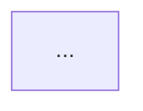

# Logic Visualization — Reverse Engineering Phase 2

Convert source code into Mermaid flowcharts with line-number traceability. This skill reads its targets from `manifest.json` (populated by Phase 1) and processes each component's methods.

## Three Principles

### 1. Code is Truth
- Document the ACTUAL code flow, not idealized versions
- Include dead code or seemingly redundant logic
- If code appears buggy, document as-is and note in Question List

### 2. Traceability to Line
- Every node in a Mermaid diagram MUST include a line number: `"Action (L{line})"`
- If a line number cannot be determined, exclude that node

### 3. Behavior over Intent
- Focus on observable actions: method calls, DB operations, network I/O, state mutations
- Do NOT add implied steps not present in code

## Execution

### Step 1: Load Manifest and Determine Targets

Read `docs/reverse/{analysis}/manifest.json`.

Verify:
- `phase1.status` is `"verified"` — if not, report error and stop
- `phase1.targets_for_phase2` contains entries

Determine which components to process:
- If `component` argument is provided, process only that component
- If omitted, process all entries in `phase2.remaining`
- If `phase2.remaining` is empty and `phase2.completed` has entries, all components are done

Set `phase2.status` to `"in_progress"` in the manifest.

Detect language from `manifest.language` and load `references/{language}.md` if it exists.

### Step 2: Read Target Code

For each target component from the manifest:

**With Serena:**
```
mcp__serena__find_symbol(
    name_path_pattern="{method_name}",
    relative_path="{file}",
    include_body=true,
    depth=0
)
```

**Without Serena:**
- Use Read to load the source file
- Use Grep to locate method boundaries

For each method, identify:
- **Control flow**: if/else, switch/case, for/while, try/catch
- **Data operations**: variable assignments, transformations
- **Side effects**: database operations, network I/O, file I/O, logging, state mutations

Record the line number for each element.

### Step 3: Build Flowchart

**Mermaid syntax rules** (prevent parse errors):
- No special characters in text: use `value not 0` not `value != 0`
- No array/generic syntax: use `byte array` not `byte[]`
- No method call parentheses: use `Method param1 (L50)` not `Method(param1)`
- No comparison operators in conditions: use `|status not OK|` not `|status != OK|`
- No brackets in text: use `lastConnect index (L60)` not `_lastConnect[index]`
- Always suffix line numbers: `(L{number})`

**Diagram structure by complexity:**
- Simple (< 50 lines): Single flowchart
- Medium (50-150 lines): Flowchart with subgraphs
- Complex (> 150 lines): Multiple diagrams (one per major section)
- If > 30 nodes in a single diagram, split into multiple diagrams

**Verify line numbers** before finalizing:
1. Re-read source code using Read tool
2. Confirm each line number is accurate
3. If uncertain, use range: `(L40-45)`

### Step 4: Document Side Effects

For each method, catalog:

**Database operations:**
| Operation | Line | Entity/Table | Method | Purpose |
|:----------|:-----|:-------------|:-------|:--------|

**External communication:**
| Type | Line | Target | Data | Purpose |
|:-----|:-----|:-------|:-----|:--------|

**State mutations:**
| Variable | Line | Operation | New Value | Scope |
|:---------|:-----|:----------|:----------|:------|

**Logging:**
| Level | Line | Message Template | Context |
|:------|:-----|:-----------------|:--------|

### Step 5: Generate Output

Write to `docs/reverse/{analysis}/02-logic-{component}.md`:

```markdown
# Logic Flow: {component}

**Analysis Date**: {YYYY-MM-DD}
**Source File**: [{file}]({file})
**Target Method**: `{method}` at Line {start}-{end}
**Complexity**: {simple / medium / complex}

## Source Code

**Source**: [{file}:{line}]({file}:{line})

```{language}
// Line {start}-{end} from {file}
{code}
```

## Logic Flowchart



## Node-to-Line Mapping

| Node | Description | Source Line | Code Snippet | Notes |
|:-----|:------------|:-----------|:-------------|:------|
| {id} | {description} | L{line} | `{code}` | {notes} |

## Side Effects Summary

{tables from Step 4}

## Question List

### Suspected Issues
- [ ] **{description}** — [{file}:{line}]({file}:{line})

### Unclear Logic
- [ ] **{description}** — [{file}:{line}]({file}:{line})
```

### Step 6: Update Manifest

After each component is processed:
- Add entry to `phase2.completed`: `{"component": "{name}", "output": "02-logic-{name}.md", "verification": null}`
- Remove from `phase2.remaining`
- Add entry to `phase2.targets_for_phase3`: `{"component": "{name}", "logic_diagram": "02-logic-{name}.md", "source_file": "{file}"}`

After all components are processed:
- Set `phase2.status` to `"completed"`
- Update `updated` timestamp

## Validation Before Completion

- [ ] Every Mermaid node has a line number `(L{num})`
- [ ] No special characters in Mermaid text
- [ ] All line numbers verified against source code
- [ ] Node-to-line mapping table is complete
- [ ] Side effects are documented
- [ ] Mermaid diagram parses without errors
- [ ] manifest.json is updated with completed components and Phase 3 targets

## Prohibited Actions

- Do NOT add nodes for implied logic not in code
- Do NOT simplify or omit bad code — document as-is
- Do NOT use special characters in Mermaid text
- Do NOT guess line numbers — verify or use range
- Do NOT modify source code files
